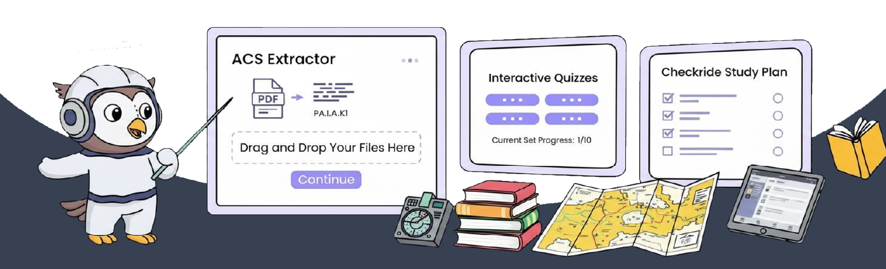

  

[**Website**](https://cfipros.com) • [**Docs**](https://docs.cfipros.com) • [**Community**](https://github.com/marcusgoll/CFIPros-frontend/discussions) • [**Roadmap**](https://github.com/marcusgoll/CFIPros-frontend/projects) • [**Why CFIPros?**](#why-cfipros) • [**Changelog**](CHANGELOG.md) • [**Bug Reports**](https://github.com/marcusgoll/CFIPros-frontend/issues/new?template=bug_report.yml)

  

**CFIPros is the all-in-one, open source platform for flight instructor training and certification**

CFIPros provides every tool CFI candidates need to pass their checkride including:

**📊 AKTR to ACS Mapper**: Upload your FAA Airman Knowledge Test Reports (AKTR) and automatically get personalized ACS study recommendations. Our secure processor identifies weak areas and generates targeted study plans based on your specific knowledge gaps.

**📊 ACS Code Analysis**: Automatically extract and organize ACS codes from your training materials. Upload PDFs, lesson plans, or study guides and get structured content instantly.

**📚 Smart Study Plans**: AI-powered study plan generation based on your training timeline, experience level, and specific CFI track (CFII, MEI, etc.).

**📱 Mobile-First Learning**: Study anywhere with responsive design optimized for tablets and phones. Perfect for studying during layovers or between flights.

**🎯 Progress Tracking**: Visual progress indicators, completion tracking, and performance analytics to keep you on track for checkride success.

**🔒 Secure File Management**: Upload and organize training materials with enterprise-grade security. Magic byte validation and content scanning keep your data safe.

**🧪 Practice Scenarios**: Interactive scenarios and case studies based on real CFI checkride experiences.

**📈 Performance Analytics**: Detailed insights into your study patterns, strengths, and areas needing improvement.

**🤝 Community Features**: Connect with other CFI candidates, share study materials, and get feedback from experienced instructors.

Best of all, the frontend is **completely open source** with a generous free tier for students and instructors. Get started by [**signing up for CFIPros**](https://cfipros.com) today!

## Table of Contents

- [Getting Started with CFIPros](#getting-started-with-cfipros)
- [Setting up Your Training](#setting-up-your-training)
- [Why CFIPros?](#why-cfipros)
- [Contributing to CFIPros](#contributing-to-cfipros)
- [Open Source vs. Paid Features](#open-source-vs-paid-features)
- [We're Hiring Pilots and Developers!](#were-hiring-pilots-and-developers)

## Getting Started with CFIPros

### 🚀 Start Your CFI Training Journey

The fastest way to get started with CFIPros is signing up for free at [**cfipros.com**](https://cfipros.com). Your first study plans, file uploads, progress tracking, and basic analytics are completely free, after which you pay based on usage.

**Start your CFI journey today:**

1. 📝 **[Sign up for free](https://cfipros.com/signup)** - No credit card required
2. 📋 **Take the assessment** - Tell us about your aviation background and goals
3. 📚 **Get your study plan** - Receive a personalized CFI training roadmap
4. 🚀 **Start studying** - Upload materials, track progress, connect with the community

### 💻 For Developers

This repository contains the open source frontend code that powers CFIPros. While you can explore the codebase, contribute improvements, and learn from our implementation, CFIPros operates as a software-as-a-service platform.

**Developer contributions welcome:**

- 🐛 **Bug fixes** and performance improvements
- ✨ **Feature enhancements** for aviation training workflows
- 📚 **Documentation** improvements and examples
- 🔒 **Security** enhancements and vulnerability reports
- 🎨 **UI/UX** improvements for better user experience

Ready to contribute? Check out our [Contributing Guidelines](CONTRIBUTING.md) to get started.

## Setting up Your Training

Once you have access to CFIPros, you can start your CFI training journey with our step-by-step setup:

### 📋 Initial Assessment

- **Experience Level**: Tell us about your current certificates (PPL, CPL, etc.)
- **Training Timeline**: When do you want to take your CFI checkride?
- **CFI Track**: Which CFI certificates are you pursuing? (CFI, CFII, MEI)
- **Learning Style**: Visual, hands-on, structured study, or mixed approach?

### 📚 Study Plan Generation

Based on your assessment, CFIPros automatically creates a personalized study plan including:

- **ACS Coverage**: Complete mapping of all required ACS codes
- **Timeline Management**: Realistic milestones based on your availability
- **Resource Recommendations**: FAA publications, training materials, and practice scenarios
- **Progress Checkpoints**: Regular assessments to ensure you're on track

### 🎯 Platform Features You'll Use

| Feature               | Description                        | Free Tier         | Pro                   |
| --------------------- | ---------------------------------- | ----------------- | --------------------- |
| **Study Plans**       | AI-generated personalized roadmaps | ✅ 3 plans/month  | ✅ Unlimited          |
| **File Upload**       | Secure document management         | ✅ 100MB total    | ✅ 10GB total         |
| **ACS Analysis**      | Automated code extraction          | ✅ 5 docs/month   | ✅ Unlimited          |
| **Progress Tracking** | Visual progress indicators         | ✅ Basic tracking | ✅ Advanced analytics |
| **Community Access**  | Connect with other CFI candidates  | ✅ Forums only    | ✅ Direct messaging   |
| **Mobile App**        | iOS/Android companion              | ✅ Read-only      | ✅ Full features      |

## Why CFIPros?

  
  
<i>Your personalized CFI training dashboard</i>

### 🎯 Built by CFIs, for CFI Candidates

CFIPros was created by certified flight instructors who understand the challenges of CFI training. We've been through the process and built the platform we wish we had.

### 📊 Data-Driven Training

Our platform tracks your progress across all ACS areas, identifying knowledge gaps and adjusting your study plan automatically. No more guessing what to study next.

### 🤝 Community-Powered

Connect with thousands of CFI candidates and experienced instructors. Share study materials, ask questions, and get feedback on your teaching scenarios.

### 🔒 Secure & Reliable

Enterprise-grade security protects your training materials and personal data. 99.9% uptime SLA ensures you can study whenever inspiration strikes.

## Learning More About CFIPros

### 📖 Open Source Everything

Our code isn't the only thing that's open source! We also open source our training methodologies, study guides, and even our company processes. Check out our [Aviation Training Handbook](https://docs.cfipros.com/handbook) for insights into effective CFI training.

### 🎓 Success Stories

Don't just take our word for it - here's what CFI candidates are saying:

> _"CFIPros cut my study time in half. The ACS mapping feature alone saved me weeks of manual organization."_  
> **— Sarah M., CFI • Phoenix, AZ**

> _"The community aspect is incredible. Having experienced CFIs review my lesson plans was invaluable."_  
> **— Mike R., CFII • Denver, CO**

> _"I used CFIPros for my MEI and passed on the first try. The scenario-based practice was spot-on."_  
> **— Jessica L., MEI • Miami, FL**

### 📊 Platform Statistics

- **12,000+** CFI candidates trained
- **95%** first-time checkride pass rate
- **500+** flight schools using CFIPros
- **50,000+** training documents uploaded
- **24/7** community support and mentoring

## Success with CFIPros: A Complete Training Journey

  
  

### Phase 1: Foundation Building (Weeks 1-4)

- Upload your existing study materials and lesson plans
- Complete the comprehensive aviation knowledge assessment
- Receive your personalized study plan with timeline
- Join study groups based on your CFI track and location

### Phase 2: Intensive Study (Weeks 5-12)

- Work through structured lessons covering all ACS areas
- Practice with scenario-based learning modules
- Track progress with detailed analytics and feedback
- Connect with mentors and experienced CFIs

### Phase 3: Checkride Preparation (Weeks 13-16)

- Mock checkrides with DPE-style scenarios
- Final knowledge gaps identification and remediation
- Teaching practice with community feedback
- Checkride scheduling and logistics support

  
  
<i>Track your progress across all ACS areas with detailed analytics</i>

## Contributing to CFIPros

We ❤️ contributions from both the aviation community and developers! Your input helps make CFI training better for everyone.

### 🛩️ For Aviation Professionals

- **Share Your Experience**: Submit checkride scenarios, lesson plans, and study techniques
- **Review Content**: Help us ensure accuracy of aviation information and ACS coverage
- **Mentorship**: Guide new CFI candidates through our community platform
- **Beta Testing**: Get early access to new features and provide feedback

### 💻 For Developers

- **Open Source Code**: Contribute to our Next.js 15 frontend with modern React patterns
- **API Integrations**: Help us connect with aviation tools and services
- **Mobile Apps**: Native iOS/Android development opportunities
- **Security**: Aviation platforms require the highest security standards

### 📚 For Educators

- **Curriculum Development**: Help design effective CFI training pathways
- **Assessment Tools**: Create better ways to measure training progress
- **Learning Analytics**: Improve our understanding of effective study patterns
- **Accessibility**: Make aviation training more inclusive and accessible

**Ready to contribute?** Check out our [Contributing Guidelines](CONTRIBUTING.md) or join our [Community Discussions](https://github.com/marcusgoll/CFIPros-frontend/discussions).

## Open Source vs. Paid Features

This repository is available under the MIT license - completely free to explore, learn from, and contribute to.

### ✅ Open Source Contributions

- Complete frontend user interface code
- Modern React/Next.js implementation patterns
- Aviation-specific UI components and design system
- Security implementations and best practices
- Testing strategies and quality assurance patterns
- All source code available for learning and contribution

### 🚀 CFIPros Platform (SaaS)

CFIPros operates as a software-as-a-service platform with these features:

| Feature            | Free Tier  | Basic ($29/mo) | Pro ($79/mo) | Flight School ($199/mo)   |
| ------------------ | ---------- | -------------- | ------------ | ------------------------- |
| **Users**          | 1 user     | 1 user         | 1 user       | Up to 50 students         |
| **AI Study Plans** | ✅ 3/month | ✅ 5/month     | ✅ Unlimited | ✅ Unlimited              |
| **ACS Analysis**   | ✅ 5/month | ✅ 20/month    | ✅ Unlimited | ✅ Unlimited              |
| **Storage**        | 100MB      | 1GB            | 10GB         | 100GB                     |
| **Community**      | Forums     | Forums + Chat  | All access   | Private groups            |
| **Support**        | Community  | Email          | Priority     | Dedicated account manager |
| **API Access**     | ❌         | ❌             | ✅           | ✅                        |
| **White Labeling** | ❌         | ❌             | ❌           | ✅                        |

The pricing is completely transparent and available on our [pricing page](https://cfipros.com/pricing).

**Want to contribute?** This open source frontend welcomes contributions from the aviation and developer communities. Help us make CFI training better for everyone!

## We're Hiring Pilots and Developers!

  
  
<i>Building the future of aviation training</i>

**Hey! If you're reading this README all the way to the end, you might be exactly who we're looking for.**

We're a team of passionate aviators and developers building the future of flight instructor training. If you're excited about:

- **Aviation Safety**: Using technology to train better flight instructors
- **Open Source**: Contributing to the aviation community through code
- **Modern Development**: Next.js, React, TypeScript, and cutting-edge tools
- **Remote-First Culture**: Work from anywhere with flexible schedules
- **Professional Growth**: Learn aviation while building world-class software

**We'd love to hear from you!**

### 🛩️ Open Positions

- **Senior Frontend Developer** (React/Next.js expertise)
- **Aviation Content Specialist** (CFI/CFII with curriculum development experience)
- **Full-Stack Developer** (Next.js + Python/FastAPI)
- **DevOps Engineer** (AWS/Docker/Kubernetes)
- **UX/UI Designer** (Aviation/education platform experience preferred)

### 📧 Get in Touch

- **Careers**: [careers@cfipros.com](mailto:careers@cfipros.com)
- **General Inquiries**: [hello@cfipros.com](mailto:hello@cfipros.com)
- **Technical Questions**: [GitHub Discussions](https://github.com/marcusgoll/CFIPros-frontend/discussions)

---

## 🏢 About CFIPros

**CFIPros** is revolutionizing flight instructor training through modern technology and deep aviation expertise. Founded by certified flight instructors who experienced firsthand the challenges of CFI training, we're building the platform we wish we had.

### 🌐 Connect With Us

- **Website**: [cfipros.com](https://cfipros.com)
- **Documentation**: [docs.cfipros.com](https://docs.cfipros.com)
- **Community**: [GitHub Discussions](https://github.com/marcusgoll/CFIPros-frontend/discussions)
- **Twitter**: [@CFIPros](https://twitter.com/CFIPros)
- **LinkedIn**: [CFIPros](https://linkedin.com/company/cfipros)
- **YouTube**: [CFIPros Channel](https://youtube.com/@cfipros)

### 🎯 Our Mission

_"To make flight instructor training more accessible, effective, and enjoyable through innovative technology and community support."_

### 🏆 Recognition

- **AOPA Flight Training Excellence Award** (2024)
- **EAA Innovation in Aviation Education** (2024)
- **GitHub Social Impact Award** (2024)
- **Featured in Flying Magazine, AOPA Pilot, and Aviation Week**

---

### 🛩️ **Built with ❤️ by aviators, for aviators** ✈️

_Every line of code in this repository contributes to safer skies and better-trained flight instructors worldwide._

**Ready to start your CFI journey?** [**Sign up for free at CFIPros.com**](https://cfipros.com/signup) 🚀

---

**P.S.** If you made it this far, you're clearly passionate about aviation and technology. We'd love to connect with you - whether you're a CFI candidate, experienced instructor, or developer interested in aviation. Reach out anytime!

📧 **hello@cfipros.com** | 🐙 **[@marcusgoll](https://github.com/marcusgoll)** | ✈️ **Flying safer skies together**
